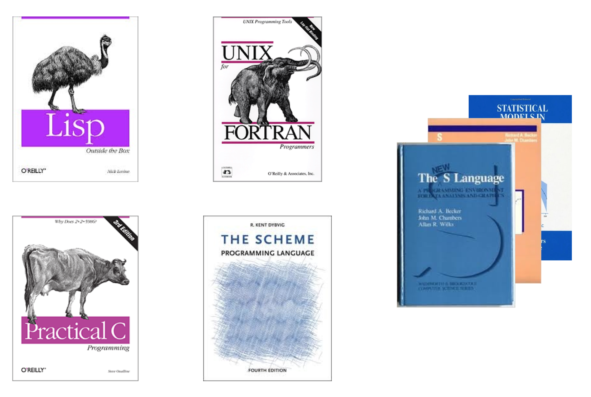

```{r, echo=FALSE}
require(memoise, quietly = TRUE)
require(knitr, quietly = TRUE)
read_chunk("randomwalk.R")
read_chunk("fib.R")
read_chunk("knapsack.R")
```
## The R language {.flexbox .vcenter}

<div class="notes">
- in 1993
- get the books
- pick your favorite pages and put them into single book
- you get R language spec
- the result?
</div>

## The R language {.flexbox .vcenter}

<div class="notes">
- like this dog
- isn't it cute?
</div>

## R fundamental styles
- Domain specific language (DSL)
- Designed for interactive use
- Functional and imperative
- Object oriented
- Lazy
- Vector / multidimensional language

<div class="notes">
- DSL for statistics or analysing data
- language has shortcuts for ineractive use but they do not work in programms e.g. subset
- you can mix programming styles
- exverything is `Promise` and evalueted on the first use
- everything is vector or list
</div>

## Data Structures

- 0-dim a.k.a scalar: **does not exist**
- 1-dim: **vector** or **list**
- 2-dim: **matrix** (2D array) or **data.frame**
- n-dim: **array**

- vector / matrix / array: homogeneous (preferred)
- list / data.frame: heterogeneous

<div class="notes">
- the first surprise; constant assignment creates vector (later)
- use the first ones if you can
- memory overhead around 40b per variable
</div>

## matrix
- It is a structure / object: `c()` + metadata
- Filled by columns ( `by.row = FALSE` )
- Dimmensions stored as attributes

```{r}
m <- matrix(4:1, 2, 2)
dump("m", "")
```

<div class="notes">
- `c()` creates vector
</div>

## data.frame
- It is a structure / object: `list()` + metadata
- Columnar data structure
- Row / Column names are stored as attributes

```{r}
df <- data.frame(x = 1:5, y = 5:1)
dump("df", "")
```

<div class="notes">
- similar to matrix
- list instead of vector
- rownames
</div>

## Vectors
```{r}
identical(c(1), 1) # No scalar type
```

```{r}
length("aaa") # Use `nchar()` for string length
```

```{r}
s <- "a"; s[5] <- "e"; s # NAs generated
```

<div class="notes">
- `identical()` is the only one way how to test exact equality in R
</div>

## Vectors

```{r}
c("aaa", 1.0, 1) # The most generic type wins
as.numeric(c("aaa", 1, 1)) # explicitly
```
- order: `logical`, `numeric`, `complex`, `character`
```{r}
c(1, c(2, c(3, c(4))), 5) # Always flat
```

<div class="notes">
- coercion rules are sensible
- use explicit conversion to get what you need
</div>

## Vectors

- Type `typeof()`: logical, integer, double, character (and few more)
- Length `length()`: number of elements
- Attributes `attributes()`: metadata

<div class="notes">
- some attributes have special meaning and are used by functions (dim, names, class, ...)
- you can tag your variables with addtional metadata e.g store SQL query, source file name, ...
</div>

## Vectorisation

- Almost all functions are vectorised
```{r}
identical(log(c(1, 2)), c(log(1), log(2)))
```
- There are some expections
```{r}
identical(sum(c(1,2),c(3), 4), sum(c(1,2,3,4)))
```

```{r}
identical(mean(1,2,3,4), mean(c(1,2,3,4)))
```

<div class="notes">
- the last one is nasty
- no warning about unused arguments
</div>

## Random Walk
```{r walk1, eval=FALSE}
```

```{r walkplot, echo=FALSE, fig.height=3.5}
plot(
  1:100,
  cumsum(sample(c(-1, 1), 100, replace = TRUE)),
  type="l",
  ylab="",
  xlab=""
)
```

## Random Walk
```{r walk1, eval=FALSE}
```

- Preallocate output vector `x`

<div class="notes">
- `x` is growing
- `x` variable is copied inside of the loop
</div>

## Random Walk
```{r walk2, eval=FALSE}
```

- `sample(c(-1, 1)` does not depend on `i`
- compute all "steps" before loop

## Random Walk
```{r walk3, eval=FALSE}
```

- `x[i] <- x[i - 1] + x[i]` is cumulative sum
- there is a function for it: `cumsum()`

<div class="notes">
- vector modification can create new copy of vector if there is reference
</div>

## Random Walk
```{r walk4, eval=FALSE}
```

```{r walk5, eval=FALSE}
```
```{r walk6, eval=FALSE}
```

- Vectorised code
- Clear and transparent code
- No loops => no +1 or -1, zero, one indexing mistakes

## Random Walk - Benchmark {.flexbox .vcenter}
```{r, randomwalkbench, cache=TRUE, echo=FALSE, message=FALSE}
source("randomwalk-bench.R")

ggplot(bench.result) +
  geom_line(aes(x = size, y = elapsed, colour = test)) +
  xlab("Step") +
  ylab("Elapsed time [s]") +
  theme_bw()
```

<div class="notes">
- olive - green: growing vector in place
- green - blue: function call prenalty
- `Reduce()`: partialy inplemented in R and then calls `vapply()`
</div>

## Vectorisation
- Is *not* an optimisation technique
- It is a way of thinking
- Use Rcpp for hard problems
- Loop hiding: `lapply()`, `sapply()`, `vapply()`, `replicate()`, `mapply()`...
- Higher-Order Functions: `Reduce()`, `Filter()`, `Find()`, `Map()`, ...
- Data Summary: `aggregate()`, **plyr**, **dplyr**, **data.table**
- Watch out for **recycling rule**

<div class="notes">
- `*apply`: efficient for loops
- `Map()` is identical to `mapply()`
- Learn about `data.table`
</div>

## Recycling
```{r}
1:10 + 1
1:10 + 1:2
1:10 + c(1,2,1,2,1,2,1,2,1,2)
1:10 + 1:3
```

## R is functional
- Functions are **first-class** but **lazy** citizens
    - Function can return function
    - Function can be assigned to variable or list
    - Function can be passed as an argument

```{r, eval=FALSE}
sum.poly <- function(order) {
  function(x) sum(x^order)
}

sum.sq <- sum.poly(2)

apply(data, 1, sum.sq)
```

<div class="notes">
- the first one is `clousure` example (encloses over `order` argument)
- lazy: function must be called inside of function to be evaluated
</div>

## Everything is a function

```{r}
identical(`+`(3,4), 3 + 4)
identical(`:`(1, 10), 1:10)
identical(`<-`(a, 5), a <- 5)
x <- 0; identical(`[`(x, 1), x[1])
```

## Everything is a function

- Count the number of function calls
```{r, eval=FALSE}
if(a > 5) {
  print("`a` is large")
} else {
  print("`a` is small")
}
```

## Everything is a function

```{r}
`if`(TRUE, "true", "false")
`for`(i, 1:2, print(i))
`{`(1,2,3)
`(`(1)
```

## Fibonacci {.flexbox .vcenter}


## Fibonacci {.build}
```{r, fib}
```
- Repetition
```{r, fib-compute, echo=FALSE, fig.height=2}
library(igraph)
source("fib.R")
g <- graph.empty() +
  vertices(fib.direct(1:5), color="black") +
  edges(c(2,1, 3,1, 3,2, 4,2, 4,3, 5,3, 5,4), color="black")

par(mar = rep(0, 4))
plot(g, vertex.size = 60, vertex.color="white", vertex.label.color="red")
```

## Fibonacci - cache
```{r, fib.ugly}
```

## Fibonacci - memoise
```{r, fib.m}
```

## Fibonacci
- Direct computation
```{r, fib.direct, evel=FALSE}
```

## Fibonacci - vectorised
```{r, fib.vec}
```

## Fibonacci - Benchmark {.flexbox .vcenter}
```{r, fibbench, cache=TRUE, echo=FALSE, message=FALSE, warning=FALSE}
source("fib-bench.R")

ggplot(bench.result) +
  geom_line(aes(x = size, y = elapsed, colour = test)) +
  xlab("fibonacci(1:N)") +
  ylab("Elapsed time [s]") +
  ylim(c(0,0.15)) +
  scale_x_log10(limits=c(1, 1000)) +
  theme_bw()
```

## Knpasack Problem
- Maximise value of items
- but do not exceed the limit


## Knpasack Problem
```{r, knapsack1}
```
- Inefficient
- Dynamic programming problem

## Knpasack Problem
```{r, knapsack2}
```
- Loops and indexing issues

## Knpasack Problem
```{r, knapsack3}
```
- Vectorised `if` is hard to understand
- `for` loop is hard to vectorise (due to `m` variable)

## Knpasack Problem
```{r, knapsack4}
```

```{r, eval=FALSE}
knapsack.rec <- function(items, w) {
  solve <- function(i, j) {
    ...
  }
  solve(nrow(items), w)
}
```

## Knpasack Problem - Benchmark  {.flexbox .vcenter}
```{r, knapsackbench, cache=TRUE, echo=FALSE, message=FALSE, warning=FALSE}
source("knapsack-bench.R")

ggplot(bench.result) +
  geom_line(aes(x = size, y = elapsed, colour = test)) +
  xlab("Items") +
  ylab("Elapsed time [s]") +
  scale_x_log10(limits=c(10, 1000)) +
  theme_bw()
```

## Resources & Credits
- [R Inferno](http://www.burns-stat.com/documents/books/the-r-inferno/) (Patrick Burns)
- [Advanced R](http://adv-r.had.co.nz/) (Hadley Wickham)
- [R language for programmers](http://www.johndcook.com/R_language_for_programmers.html) (John D. Cook)
- [Functional programming in R](http://dill.github.io/talks/rusers-functional/talk.html) (David L Miller)
- [Functional programming in R](http://www.slideshare.net/DASpringate/functional-programming-in-r) (David Springate)
- [Vectorization in R: Why?](http://www.noamross.net/blog/2014/4/16/vectorization-in-r--why.html) (Noam Ross)
- [Writing Better Statistical Programs in R](http://www.johnmyleswhite.com/notebook/2013/01/24/writing-better-statistical-programs-in-r/) (John Myles White)
- [Evaluating the Design of the R Language](r.cs.purdue.edu/pub/ecoop12.pdf)
